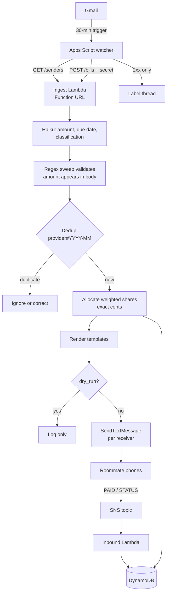

# TODO

RULES: if a todo is completed, mark it so ([x])

---

# bill-bot Refactor — CDK + Lambda + Bedrock Haiku + AWS SMS

## Problem Statement

Move bill processing off Google Apps Script into AWS. Apps Script shrinks to a thin
Gmail watcher that forwards email content to a Lambda. The Lambda uses Bedrock Claude
Haiku to extract the bill amount, due date, and bill type, validates the amount against
the raw email text, dedups per provider/month in DynamoDB, texts each roommate their
individual weighted share via AWS End User Messaging SMS, and tracks who has paid.
Everything configurable lives in a gitignored `config.yaml` applied by `cdk deploy`.
No setup wizard, no Google Cloud OAuth client, no sample-email collection.

## Confirmed Requirements

1. **AWS only.** AWS End User Messaging SMS, 1:1 fan-out per roommate. No MMS, no RCS,
   no Twilio, no Telegram, no Discord.
2. **Python CDK.** Apps Script → Lambda via Lambda Function URL + shared secret header.
3. **Config drives everything:** receivers (phone, label, share weight), Venmo payee,
   message wording, sender email addresses, behavior toggles. Seeded into DynamoDB on
   every `cdk deploy`; Lambdas read DynamoDB, never the YAML file.
4. **Unequal splits.** Each receiver has a relative share weight, replacing the flat
   `ROOMMATE_COUNT` division.
5. **Configurable message text** with named placeholders, validated at deploy time.
6. **No setup step.** Haiku replaces the regex-picking wizard. The only thing a user
   maintains is the list of sender email addresses.
7. **Payment tracking.** Per-roommate ledger rows; roommates reply `PAID` to mark
   themselves paid, `STATUS` for the tally.
8. **Dedup** is deterministic on provider + billing month, handling the "bill coming
   soon" then "bill due" double-send.
9. **Labeling.** Apps Script labels Gmail threads after successful processing.

## Channel Decision (settled — do not revisit)

AWS End User Messaging **SMS** on a **toll-free number**, ~**$2.30/month**
($2.00/mo lease + ~$0.30 for ~30 messages).

Rejected alternatives, for the record:

- **MMS**: $0.02 + $0.01 carrier per message — 3× SMS for media we never send.
- **RCS**: $500 one-time agent setup + $200/mo agent maintenance + $200/yr brand
  vetting. Absurd at this scale.
- **AWS Notify** (no number required): templates are pre-approved and AWS-managed for
  verification codes only. Cannot send custom message bodies. AWS's own guidance
  directs custom bodies to `SendTextMessage`.
- **10DLC**: $1/mo number + $2/mo low-volume campaign + one-time registration/vetting
  fees = more expensive than toll-free, no benefit.
- **Short code**: $650 setup + $995/mo.

Renting a number is **required**: the US has no shared origination identities, and
Notify (the only no-number path) can't carry custom text. Toll-free verification is the
lighter registration path and supports two-way SMS, which `PAID` replies need.

## Architecture

### Extraction: Haiku primary, regex validator

Haiku receives the (truncated) email body and returns schema-constrained JSON:
`{amount, due_date, classification, confidence}` where classification ∈
`bill_due | bill_upcoming | payment_confirmation | other`.

A generic `\$?\s*([\d,]+\.\d{2})` sweep then checks whether Haiku's amount appears
verbatim in the body. Found → high confidence. Not found → flag low confidence,
**do not reject** (a false rejection silently loses a bill, which is worse than a
flagged notification).

`behavior.on_low_confidence` selects `send` (notify with warning suffix appended) or
`hold` (record it, notify nobody).

This inverts the original TODO's "regex then Haiku verify" into "Haiku then regex
verify" — necessary because dropping the wizard means there is no per-sender regex to
pick, and it doubles as a hallucination guard.

### Share allocation with exact cents

Shares are **relative weights** normalized against their own sum, so all `1` = equal
split and `2` = double. They never need to total any particular number.

Allocation uses the **largest-remainder method**: compute each share to the cent, then
distribute leftover pennies to the largest fractional remainders, ties broken by config
order. Per-person amounts must sum to the bill total **exactly**.

### Message templates

Every outbound string is a config template. Placeholders:

| Placeholder | Meaning |
|---|---|
| `{biller}` | Sender display name |
| `{total}` | Full bill amount, formatted |
| `{amount}` | This receiver's share |
| `{label}` | This receiver's name |
| `{due_date}` | Formatted due date, or `behavior.no_due_date_text` |
| `{month}` | Billing month |
| `{venmo_link}` | Pre-filled Venmo URL for this receiver's amount |
| `{zelle_line}` | Zelle instructions; empty string when `zelle_contact` unset |
| `{paid_count}` / `{receiver_count}` | Payment tally |

Validated at synth time against the allowed set **per message type**, so a typo fails
`cdk deploy` rather than surfacing at 3am when a bill arrives.

**Segment-aware cost validation:** SMS bills per 160-character segment and a Venmo URL
alone eats ~60 characters. Deploy-time validation estimates segment count per template
and prints e.g. `bill template ≈ 2 segments (~$0.02/recipient)`, warning past
`messaging.max_segments_warn`.

### DynamoDB single-table schema

| PK | SK | Attributes |
|---|---|---|
| `CONFIG` | `RECEIVER#<e164>` | label, share, active — seeded by deploy |
| `CONFIG` | `SENDER#<from_address>` | id, name — seeded by deploy |
| `BILL#<provider>#<YYYY-MM>` | `META` | total, due_date, status, classification, confidence, thread_id, source_message_ids, created_at, ttl |
| `BILL#<provider>#<YYYY-MM>` | `PAY#<e164>` | label, amount_owed, paid, paid_at, reminded_at |

- Config rows upserted **and pruned** by a custom resource on every deploy. Bill/payment
  rows are runtime data deploys never touch.
- Bills written with conditional `attribute_not_exists(PK)` → first writer wins,
  duplicate/concurrent invocations idempotent.
- `bill_upcoming` creates and notifies. A later `bill_due` for the same provider/month:
  same amount → ignore silently; different amount → `bill_due` is authoritative, update
  and send a correction.
- Gmail message IDs recorded so an identical email never reprocesses.
- Filtered `Scan` is fine for open-bill lookups at this volume; a status GSI is the
  documented upgrade path.

### Payment tracking

Writing a bill creates one `PAY#` row per receiver, all unpaid. Two-way SMS routes
inbound messages to an SNS topic → inbound Lambda. Because sends are 1:1, the inbound
number identifies the roommate unambiguously — no name parsing.

- `PAID` → flip that row, reply with `messages.paid_ack` including live tally.
  Idempotent on repeat.
- `STATUS` → reply with `messages.status`.
- Ignore carrier-reserved `STOP`, `HELP`, `UNSTOP`, and unknown numbers.

## Security Requirements

- **The Function URL is publicly reachable** with auth type `NONE`; the shared secret
  header is the only control. Required mitigations: secret in Secrets Manager,
  comparison via `hmac.compare_digest` (**never** `==`, which leaks timing), capped
  reserved concurrency so a discovered URL can't run up a Bedrock bill, request body
  size limit.
- **Email bodies go to Bedrock.** Utility bills carry account numbers and service
  addresses. Truncate bodies before the call; set DynamoDB TTL on bill records.
- **`PAID` is self-reported.** Anyone texting from a roommate's number can mark that
  roommate paid. Acceptable for a household; state it plainly in the README.
- **Set the SMS spend limit deliberately.** The account default monthly SMS threshold is
  $1.00, uncomfortably close to real ~$0.30 spend — one buggy loop either blows through
  it or gets silently blocked. Document setting it explicitly (e.g. $5) as a
  blast-radius cap.
- `config.yaml` holds phone numbers → gitignored.
- Least-privilege IAM throughout: `bedrock:InvokeModel` scoped to the configured model
  ARN, DynamoDB scoped to the table, SMS scoped to the origination identity.

## Task Breakdown

- [x] **Task 1: Project skeleton and config loader.**
  Replace Google API deps in `pyproject.toml` with `aws-cdk-lib`, `constructs`, `boto3`,
  `pyyaml`, `pytest`, `moto`. Create `app.py`, `cdk.json`, `infra/config.py` with frozen
  dataclasses for the whole tree (`Payee`, `Receiver`, `Sender`, `Messages`, `Behavior`,
  `Messaging`). Validation: unknown-key rejection, E.164 phones, positive share weights,
  duplicate phone/sender detection, non-empty receivers, template placeholders checked
  against the allowed set per message type, estimated segment count per template,
  `origination_number_id` required when `dry_run` is false. Write `config.example.yaml`;
  gitignore `config.yaml`.
  *Tests:* valid config parses; each validation failure raises naming the offending
  field; missing file yields defaults; `{nonsense}` placeholder rejected; segment
  estimate correct for a known-length template.
  *Demo:* `uv run pytest tests/test_config.py` passes; `uv run python -c "from
  infra.config import load_config; print(load_config())"` prints the parsed config; a
  template typo produces a clear error.

- [x] **Task 2: Pure domain library.**
  `lambdas/shared/` with dependency-free modules: `shares.py` (largest-remainder
  allocation), `validate.py` (dollar-amount sweep + verbatim presence check),
  `render.py` (template rendering, Venmo URL construction, conditional `{zelle_line}`).
  Port `html_to_text.py` here.
  *Tests:* allocation sums exactly to total across equal splits, weighted splits, odd
  cents, single receiver; remainder distribution deterministic; amounts found/missed by
  the sweep; rendering with and without Zelle; Venmo URL encoding.
  *Demo:* `uv run pytest tests/test_shares.py -v` shows a $100.01 bill across weights
  1/1/2 summing to exactly $100.01; a rendered SMS printed for a sample bill.

- [x] **Task 3: DynamoDB table and config seeding.**
  `infra/constructs/state_table.py` (on-demand billing, `PK`/`SK`, TTL attribute,
  `RETAIN` removal policy) plus a seeding custom resource Lambda that upserts
  `CONFIG#RECEIVER` / `CONFIG#SENDER` rows and prunes ones dropped from config. Wire
  into `infra/bill_bot_stack.py`.
  *Tests:* CDK assertions on table properties and removal policy; seeder diff logic
  (add, update, prune) against a mocked table.
  *Demo:* `cdk deploy`, then query `PK = CONFIG` to list receivers with shares and
  senders. Change a share weight, redeploy, re-query — updated, with no bill data
  disturbed.

- [x] **Task 4: Haiku extraction module.**
  `lambdas/shared/extract.py` calling `bedrock-runtime` Converse with a
  schema-constrained prompt returning amount, due date, classification, confidence.
  Truncate body first. Combine with Task 2's validator for final confidence. Handle
  throttling, malformed JSON, and refusals by falling back to the regex sweep rather
  than failing. Save anonymized bodies from the four known providers as fixtures in
  `tests/fixtures/`.
  *Tests:* stubbed Bedrock covering clean extraction, amount absent from body (low
  confidence), malformed JSON, throttling, each classification; fixture-driven tests
  asserting correct amounts for all four providers.
  *Demo:* `uv run python -m lambdas.shared.extract tests/fixtures/pge.txt` prints
  amount, due date, classification, confidence — including a due date the old regex
  approach never captured.

- [x] **Task 5: Ingest Lambda with dedup, dry-run only.**
  `lambdas/ingest/handler.py`: verify secret with `hmac.compare_digest`, load
  sender+receiver config from DynamoDB, extract via Task 4, dedup with conditional put,
  allocate shares, render messages, and in `dry_run` mode **log** instead of sending.
  Implement `GET /senders`. Add `infra/constructs/ingest_api.py` for the Function URL,
  Secrets Manager secret, reserved concurrency, and scoped `bedrock:InvokeModel`.
  *Tests:* moto-backed first-write, identical-amount duplicate, changed-amount
  correction, replayed message ID, `bill_upcoming` → `bill_due` sequence,
  `on_low_confidence: hold`; auth tests for missing/wrong/correct secret.
  *Demo:* `curl` the Function URL with a sample PG&E payload → CloudWatch logs show each
  roommate's exact message with correct weighted amounts; DynamoDB holds the bill plus
  unpaid ledger rows. Re-curl → reported duplicate. **No phone number needed for this
  task.**

- [x] **Task 6: Real SMS fan-out.**
  `infra/constructs/messaging.py` referencing the manually provisioned toll-free number
  by ID from config — kept **out** of the stack so CloudFormation can never release a
  registered number. `lambdas/shared/sender.py` sends one `SendTextMessage` per receiver
  pinned to that specific origination identity (pinning the number, not a pool,
  guarantees the same sender number every time), tolerating per-recipient failure
  without aborting the rest.
  *Tests:* mocked `pinpoint-sms-voice-v2` asserting one call per receiver with correct
  pinned identity and per-receiver amount; partial-failure test; dry-run path sends
  nothing.
  *Demo:* with your number verified in the sandbox, flip `dry_run: false`, redeploy,
  `curl` → a real SMS arrives with your weighted share and a tappable Venmo link.

- [x] **Task 7: Two-way reply handling.**
  Enable two-way SMS on the number pointing at an SNS topic; subscribe
  `lambdas/inbound/handler.py`. Handle `PAID` (flip sender's row, reply with `paid_ack`)
  and `STATUS` (reply with `status`), resolving identity by matching the inbound number
  against `CONFIG#RECEIVER` rows. Ignore `STOP`/`HELP`/`UNSTOP` and unknown numbers.
  *Tests:* moto-backed PAID, repeated PAID (idempotent), STATUS, unknown sender,
  unrecognized keyword, case and whitespace tolerance.
  *Demo:* reply `PAID` → ledger row flips, ack arrives with live tally. Reply `STATUS` →
  current tally.

- [x] **Task 8: Apps Script watcher rewrite.**
  Strip `src/` to `Main.gs`, `ApiClient.gs`, `Config.example.gs`, `appsscript.json`.
  Delete `Parser.gs`, `State.gs`, `PaymentLink.gs`, `Notifiers/`, `SendersConfig.gs`.
  `Main.gs` fetches senders via `GET /senders`, searches each over `lookback_days`,
  POSTs `{messageId, threadId, from, subject, receivedAt, bodyText}` with the secret
  header, and labels by response class: **2xx → processed, 4xx → error, 5xx → leave
  unlabeled for retry**. Trim `oauthScopes` to what remains needed.
  *Tests:* Apps Script can't be unit tested locally — verify by running against a
  dedicated test label and asserting DynamoDB state plus label transitions.
  *Demo:* run `processNewBills` against a real bill email → SMS arrives, thread labeled.
  Run again → nothing sends, blocked independently by both the label and DynamoDB dedup.

- [x] **Task 9 (optional): Unpaid reminders.**
  EventBridge schedule → Lambda finding bills with unpaid rows past a threshold,
  re-texting only those receivers using `messages.reminder`, recording `reminded_at` so
  nobody is nagged twice daily.
  *Demo:* trigger manually with a backdated unpaid row → only the unpaid roommate is
  reminded.

- [x] **Task 10: Cleanup and documentation.**
  Delete `setup/`, `build/`, `senders.config*.json`, and the OAuth entries from
  `.gitignore`. Rewrite `README.md`: AWS prerequisites, toll-free number provisioning
  and verification (with the sandbox path for testing before verification clears, and
  simulator numbers at $1/mo for development), `config.yaml` as the single configuration
  surface, deploy-then-Apps-Script ordering, the `dry_run` break-in period, the SMS
  spend-limit guardrail, ~$2.30/mo cost expectation, and every item from the Security
  Requirements section. Instruct the user to delete `credentials.json` /
  `.setup-token.json` and revoke the OAuth client. Run a clean end-to-end pass; remove
  scratch files.
  *Demo:* follow the new README from a fresh clone through a real bill producing a real
  SMS, with no Google Cloud setup anywhere in the steps.

## Decisions Already Made (do not re-litigate)

- Low confidence defaults to `send` with a warning, not `hold` — a held bill is a
  silently missed bill. Configurable.
- Shares are relative weights, not percentages, so they can't fail to sum correctly.
- The toll-free number lives outside the stack, referenced by ID, protecting a
  registered number from CloudFormation replacement at the cost of one manual step.
- `dry_run: true` is the shipped default so a fresh deploy can't text anyone before the
  logs have been read once.
- Origination identity is pinned to the specific phone number, not a pool, so the sender
  number is deterministic.
- Single provider, AWS only. No sender abstraction layer for multiple providers.

## Verification Expectations

Run `uv run pytest` after each task and `cdk synth` after any infra change. Tasks 1–5
require no AWS messaging setup at all, so there is no excuse for them to be untested.
For Tasks 6–8, state clearly what was verified against real AWS versus what was only
mocked, since toll-free verification may not have cleared.

---

## Original requirements

The original TODO items, and how the plan above satisfies (or deliberately changes)
each one.

- [x] make this app consist of a cdk project that deploys a lambda function and some way
  to run it from the google app script
  → **Satisfied.** Python CDK app (Task 1, 3, 5). Apps Script reaches the Lambda through
  a Function URL guarded by a shared secret header (Task 5, 8).

- [x] it should also consist of the google app script that checks for new emails from my
  billers and calls the lambda function with the email content
  → **Satisfied.** Task 8 reduces Apps Script to search → POST → label.

- [x] run a simple regex on the email content to extract the bill amount and due date
  and also run it through bedrock claude haiku to make sure the cost is accurate
  → **Changed: roles inverted.** Haiku extracts, the regex sweep validates. Dropping the
  setup wizard means there is no per-sender regex left to extract with, so Haiku became
  primary and the generic dollar-amount sweep became a hallucination guard confirming
  Haiku's number appears verbatim in the email. Same two independent checks, better
  failure mode, and Haiku also supplies the due date the regex path never handled well.
  (Task 2, 4)

- [x] send a rcs text message to a certain group chat with the price of the bill and a
  venmo request link to pay it and a zelle request link to pay it
  → **Changed on three counts.**
  **RCS → SMS:** RCS costs $500 setup + $200/mo agent maintenance, which is absurd for a
  household. SMS on a toll-free number is ~$2.30/mo total.
  **Group chat → 1:1 fan-out:** RCS for Business is agent-to-consumer only and has no
  group chats; AWS's send APIs take a single destination number. Each roommate gets their
  own message with their own share — which also makes `PAID` replies unambiguous.
  **Zelle request link → plain text:** Zelle publishes no deep-link or request URL
  scheme, so messages carry a `{zelle_line}` with the handle and amount as text. The
  Venmo `venmo.com/?txn=pay&...` link works as before. (Task 2, 6)

- [x] the email needs to be configurable in the project and can be updated with cdk
  deploy
  → **Satisfied.** Sender addresses live in `config.yaml` and are seeded to DynamoDB on
  every `cdk deploy`; the Lambda and Apps Script both read that list, so adding a biller
  needs no code change and no `clasp push`. (Task 1, 3, 5)

- [x] there needs to be a way to simply iterate through current bills in an inbox and
  extract the price out of them using several regex scripts (user chooses which is
  right) and save that choice for that billing provider
  → **Removed as unnecessary.** This was the Python setup wizard, and Haiku makes the
  whole regex-picking step obsolete: no sample-email collection, no Google Cloud OAuth
  client, no `credentials.json`, no per-provider stored choice. Setup shrinks to listing
  sender addresses in `config.yaml`. The tradeoff is you no longer eyeball a pattern
  before trusting it, so `dry_run: true` ships as the default for a supervised break-in
  period. (Task 4, 10)

- [x] sometime i get multiple bills from the same provider for the same month, one email
  saying bill coming soon and one saying bill due - needs to manage that statefully,
  maybe a dynamodb table with a state of which bills have been processed for the given
  month and the price so if one comes along with the same month and price it can be
  ignored - haiku would be good to use here too
  → **Satisfied, with dedup kept deterministic.** DynamoDB keyed `BILL#<provider>#<YYYY-MM>`
  with a conditional write. Haiku *classifies* (`bill_due` / `bill_upcoming` /
  `payment_confirmation` / `other`); DynamoDB *decides*. Same amount → ignored; different
  amount → the `bill_due` email wins and a correction goes out. Deliberately not an LLM
  judgment call, so a re-run can never disagree with the first run. (Task 3, 5)

- [x] also i want to flag the emails using the app script when they come in after they
  have been processed
  → **Satisfied and hardened.** Labels are applied by response class: 2xx →
  `Bill-Bot/Processed`, 4xx → `Bill-Bot/Error`, 5xx → left unlabeled so a transient
  outage retries on the next run instead of losing the bill. (Task 8)

### Added beyond the original list

- **Unequal split shares.** Per-receiver weights with largest-remainder cent allocation,
  so per-person amounts sum to the bill total exactly rather than drifting a few cents.
- **Payment tracking.** Per-roommate ledger rows; reply `PAID` to mark yourself paid,
  `STATUS` for the tally. Optional unpaid reminders (Task 9).
- **Fully configurable message wording** with deploy-time placeholder validation and
  SMS segment-count cost estimates.
- **`dry_run` mode** so the whole pipeline is testable without a phone number.
